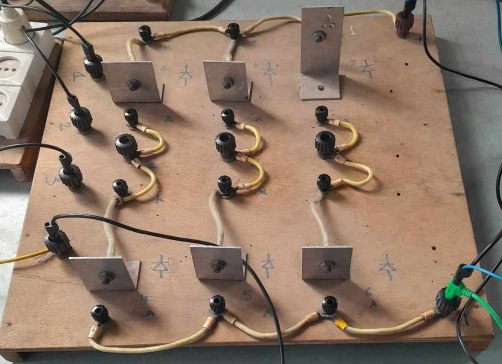
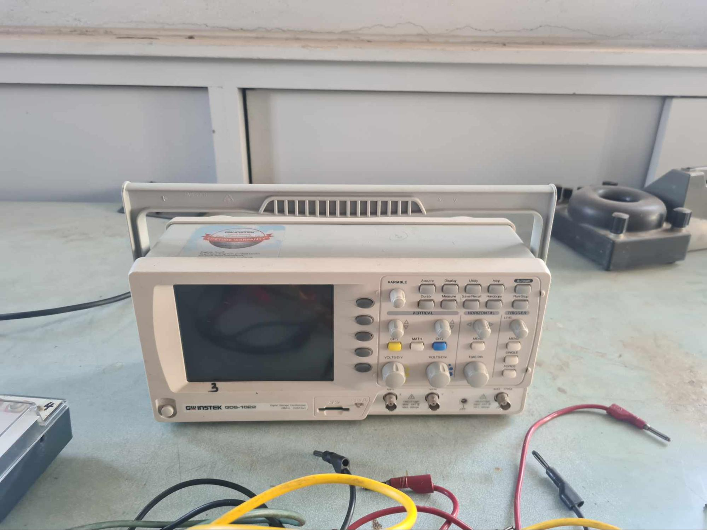
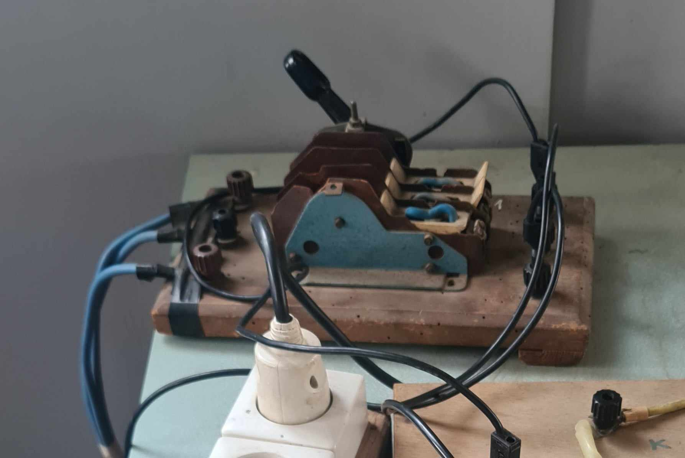
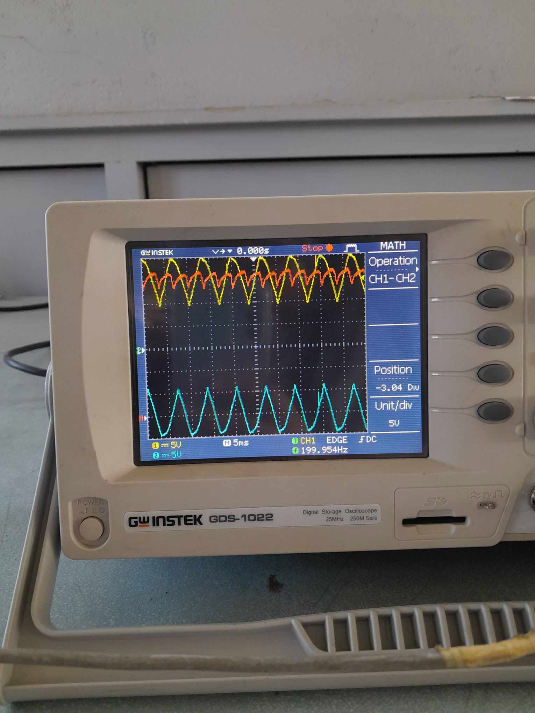
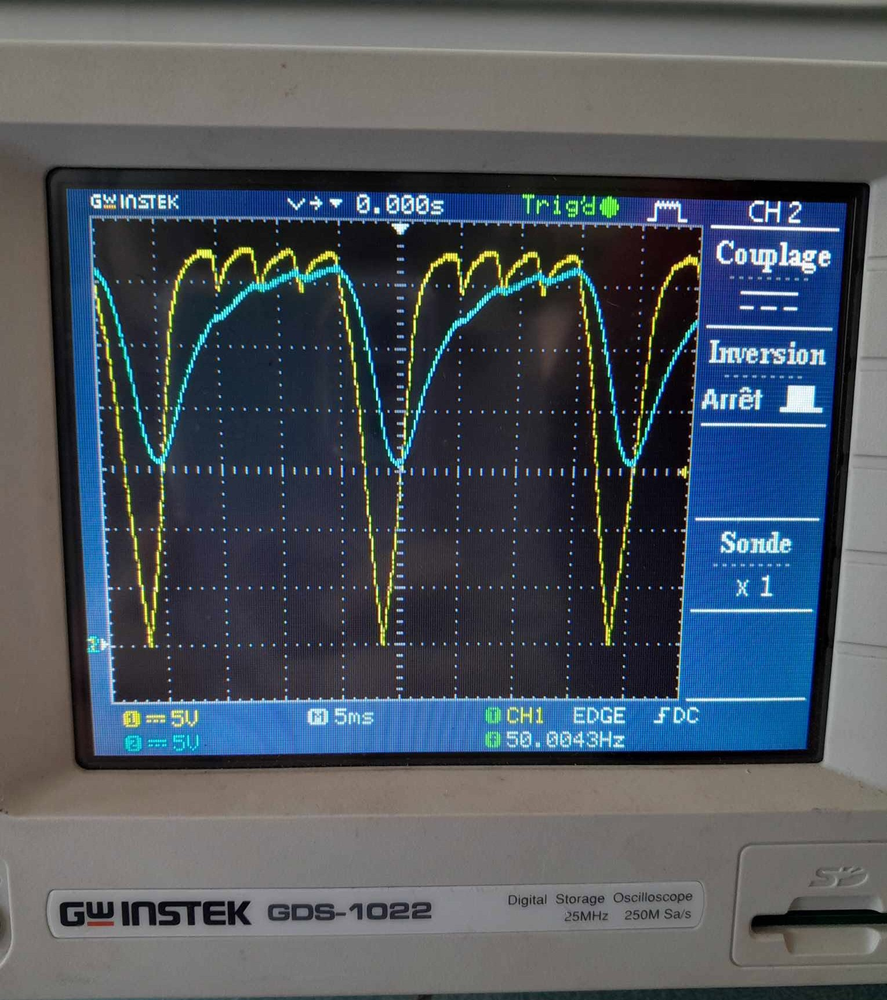

<h3>Project Overview</h3>

  This project focuses on the <strong>study and experimental implementation of a three-phase diode rectifier</strong>,
  a widely used power electronics converter for transforming three-phase AC voltage into DC voltage.
  The experiment examines the rectified waveforms, the effect of smoothing inductance on current ripple,
  and the anodic overlap phenomenon during single and double commutation.

<h3>Objectives</h3>

<ul>
  <li>Observe the rectified waveforms of a three-phase diode rectifier with single commutation.</li>
  <li>Study the effect of the smoothing inductor on the rectified current ripple.</li>
  <li>Analyze the anodic overlap phenomenon for single and double commutation.</li>
</ul>
<h3>Experimental Setup</h3>

<table>
  <thead>
    <tr>
      <th>Element</th>
      <th>Image</th>
      <th>Description</th>
    </tr>
  </thead>
  <tbody>
    <tr>
      <td><strong>Three-Phase Diode Bridge</strong></td>
      <td></td>
      <td>
        Six-diode rectifier bridge used to convert the three-phase AC voltage
        into a pulsating DC voltage.
      </td>
    </tr>
    <tr>
      <td><strong>Oscilloscope</strong></td>
      <td></td>
      <td>
        Used to observe and analyze the input and rectified voltage and current
        waveforms, as well as the commutation phenomena.
      </td>
    </tr>
    <tr>
      <td><strong>Voltmeter / Ammeter</strong></td>
      <td></td>
      <td>
        Used to measure the electrical quantities of the rectifier, including
        voltage and current values.
      </td>
    </tr>
    <tr>
      <td><strong>Three-Phase Switch</strong></td>
      <td></td>
      <td>
        Used to connect and disconnect the three-phase AC supply from the
        experimental setup.
      </td>
    </tr>
    <tr>
      <td><strong>Load Resistance and inductance (R)</strong></td>
      <td>—</td>
      <td>
        Resistive and inductance load connected to the rectifier output to study the
        rectified voltage and current under load conditions.
      </td>
    </tr>
  </tbody>
</table>
<h3>Experimental Results</h3>

  The following figure shows the <strong>output voltage across the RL load</strong>.
  The waveform illustrates the rectified voltage produced by the three-phase diode
  bridge, including the positive and negative voltage components observed during
  the experiment.

  

  The next figure presents the <strong>output voltage waveform after the loss of one
  phase</strong> in the three-phase diode bridge. The absence of one phase modifies
  the rectification sequence and results in a <strong>distorted and more irregular
  output voltage waveform</strong>, as observed experimentally.

  

  The effect of phase loss on the output current depends on the load and circuit
  conditions; therefore, the current variation should be determined from the
  experimental measurements rather than assumed from the voltage waveform alone.

